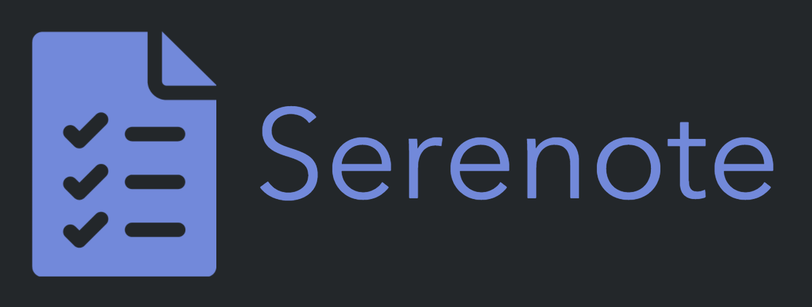

# `serenote`
> An integrated, quick-capture, project management discord bot!

![License][license-shield]
![Stars][stars-shield]
# 

The benefits to using this bot for task management include convenience and easy integration. It's very helpful to use this bot as a way to manage your staff, moderators, and other things as you run your server. Why use a seperate application with discord when you can use discord directly?
- Tasks
- Notes
- Reminders
- Events

## Usage <!-- Using the product -->
The bot is currently in development. However, you can still [**invite the bot**](https://discord.com/api/oauth2/authorize?client_id=761796288575438860&permissions=387136&scope=bot).

The prefix for the bot is `+`, Create your first task by doing `+task`!

## Contributing <!-- Using the source -->
1. Fork the repository and clone it.
2. Make a new branch to submit your pull request from.

### Running locally
1. Create a `.env` in the repository root:
   ```yml
   TOKEN=discord.bot.token
   ```

2. Run `docker-compose up --build` in the repository root.

---

Contact me · [**@LeptoFlare**](https://github.com/LeptoFlare) · [lepto.tech](https://lepto.tech)

As always, distributed under the MIT license. See `LICENSE` for more information.

_[https://github.com/LeptoFlare/serenote](https://github.com/LeptoFlare/serenote)_

<!-- markdown links & imgs -->
[stars-shield]: https://img.shields.io/github/stars/LeptoFlare/serenote.svg?style=social
[license-shield]: https://img.shields.io/github/license/LeptoFlare/serenote.svg?style=flat
